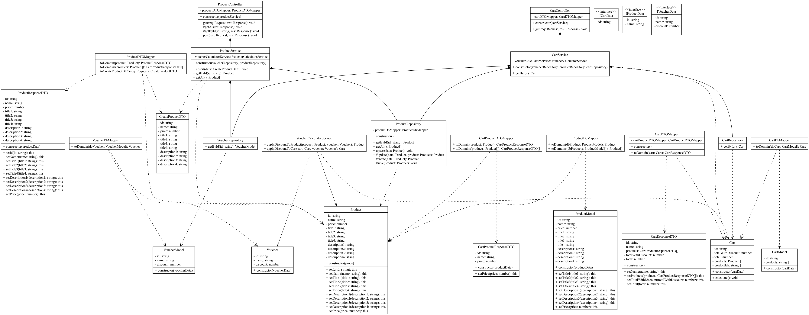

# 📖 ArchTS

**ArchTs** is a static analysis tool designed to enhance and enforce architectural decisions. It provides developers with insights into their codebase by analyzing class structures and generating Object-Oriented Programming (OOP) diagrams. This helps ensure that the architectural guidelines are followed and assists in visualizing the structure of the code.

## 🔬 Features

- **Static Analysis of Codebase**: Analyze the class structure of your TypeScript code to ensure alignment with your architectural guidelines.
- **OOP Diagram Generation**: Automatically generates OOP diagrams from the analyzed code to provide a visual representation of the class structure.
  
## 💻  Installation

To install ArchTs, you can use the following steps:

```
npm install -g archts
```

## 💻  Usage

To run ArchTs on a codebase, modify the index.ts with the right codebase path and run. Right now therre is an example project in the code that is used to develop the tool further.

```
npm run start-dev
```

The result can be seen in the `diagram.png`. 

### Example



## 🤝 Contributing

Feel free to contribute to the project by submitting issues or pull requests. Contributions are always welcome!

1. Fork the repository
2. Create a feature branch (`git checkout -b feature/AmazingFeature`)
3. Commit your changes (`git commit -m 'Add some AmazingFeature'`)
4. Push to the branch (`git push origin feature/AmazingFeature`)
5. Open a pull request

## 📜 License

This project is licensed under the MIT License - see the [LICENSE](LICENSE) file for details.